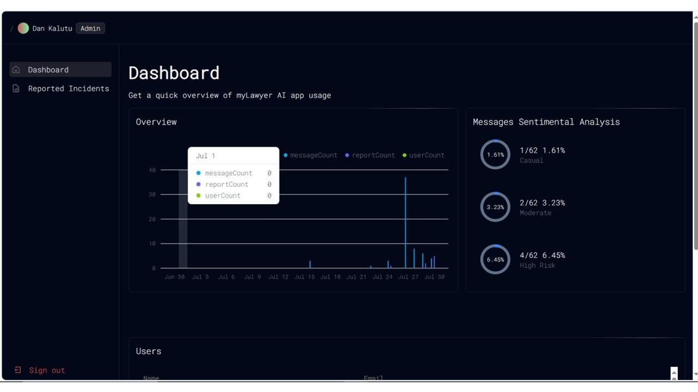

# AI-Powered Legal Chatbot

This project is an AI-powered legal chatbot developed as a final year project for a Computer Science degree. The chatbot is designed to provide accessible legal aid and guidance to users by leveraging advanced AI technologies. It features functionalities such as user registration, login, legal query processing, incident reporting, and administrative tools.

## Admin Preview

## Features

- **User Registration and Login:** Secure authentication system for users.
- **Chat Functionality:** Users can input legal questions and receive responses from the chatbot.
- **Incident Reporting:** Users can report issues directly through the chatbot interface.
- **Administrative Tools:** Admins can view users, reported incidents, and message statistics.

## Technologies Used

- **Backend:** Node.js, Express.js
- **Frontend:** TypeScript
- **AI/ML:** OpenAI's GPT-3.5
- **Database:** MongoDB
- **Authentication:** JWT
- **Rate Limiting:** Custom Middleware

## Usage

- **Register an Account:** Access the registration page and create a new user account.
- **Log In:** Use the login page to authenticate.
- **Ask Legal Questions:** Navigate to the chat page to interact with the chatbot.
- **Report Incidents:** Use the incident reporting feature to submit issues.
- **Admin Dashboard:** Access the admin dashboard to manage users and incidents.

## Contributing

If you want to contribute to this project, please fork the repository and create a pull request. Ensure that your contributions align with the project's goals and follow best practices.

